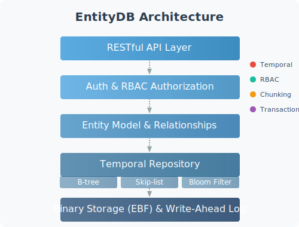

<p align="center">
  
</p>

<p align="center">Multi-Tenant Temporal Database with Tag-Based Inheritance</p>

<p align="center">
  <strong>Multi-Hub Platform</strong> • 
  <strong>Tag Inheritance</strong> • 
  <strong>Temporal Database</strong> • 
  <strong>Enterprise RBAC</strong> • 
  <strong>High Performance</strong>
</p>

## What is EntityDB?

EntityDB is a revolutionary multi-tenant temporal database platform where every tag is timestamped with nanosecond precision. It features a **Multi-Hub Architecture** with sophisticated tag-based inheritance, enabling unlimited applications on a single platform.

- **Multi-Hub Platform:** Complete isolation between applications with shared infrastructure
- **Tag Inheritance:** Elegant `dataspace:name` + `hubname:self/trait:property` architecture  
- **Temporal Database:** Every change tracked with nanosecond-precision timestamps
- **Enterprise RBAC:** Multi-level permissions (hub, trait, self) with granular access control
- **Binary Storage:** Custom format (EBF) with Write-Ahead Logging and memory-mapped files

## 🚀 Multi-Hub Architecture

**Build unlimited applications on one platform!** Each hub is a completely isolated application space:

```bash
# Create a hub for your application
curl -k -X POST https://localhost:8085/api/v1/dataspaces/create \
  -H "Authorization: Bearer $TOKEN" \
  -d '{"name":"myapp","description":"My Application Hub"}'

# Create hub-aware entities with inheritance
curl -k -X POST https://localhost:8085/api/v1/dataspaces/entities/create \
  -H "Authorization: Bearer $TOKEN" \
  -d '{
    "hub": "myapp",
    "self": {"type": "task", "status": "active", "priority": "high"},
    "traits": {"team": "backend", "project": "mobile", "org": "acme"},
    "content": "Implement user authentication system"
  }'
```

### Hub Examples

```
EntityDB Multi-Hub Platform
├── 🏢 Hub: worcha (workforce orchestrator)
├── 💰 Hub: accounting (financial management)  
├── 📦 Hub: inventory (supply chain tracking)
├── 👥 Hub: crm (customer relationships)
├── 📊 Hub: analytics (business intelligence)
├── 🏥 Hub: healthcare (patient management)
├── 🎓 Hub: education (learning management)
└── 🔧 Hub: [your-app] (infinite possibilities)
```

## 🏷️ Tag-Based Inheritance System

**Revolutionary data modeling** with natural hierarchy:

```javascript
// Entity with hub, self properties, and inherited traits
{
  "hub": "worcha",                    // Hub membership
  "self": {                           // What I am
    "type": "task",
    "status": "doing", 
    "assignee": "john"
  },
  "traits": {                         // What I belong to  
    "org": "TechCorp",
    "project": "MobileApp",
    "team": "Backend"
  }
}
```

**Stored as tags**: `dataspace:worcha`, `worcha:self:type:task`, `worcha:trait:org:TechCorp`

**Query naturally**: `?hub=worcha&self=type:task&traits=team:backend`

## 🔐 Enterprise RBAC

**Multi-level permissions** with unprecedented granularity:

```bash
# Hub-level permissions
rbac:perm:entity:*:dataspace:worcha           # Full access to worcha hub
rbac:perm:dataspace:create                    # Can create new hubs

# Trait-level permissions  
rbac:perm:entity:write:worcha:trait:org:TechCorp    # Write TechCorp entities

# Self-level permissions
rbac:perm:entity:update:worcha:self:assignee:self   # Update own assignments

# Hub management
rbac:perm:dataspace:manage:worcha             # Manage worcha hub settings
```

## 📱 Reference Application: Worcha

**Worcha** (Workforce Orchestrator) demonstrates the platform's power:

- **5-Level Hierarchy**: Organization → Project → Epic → Story → Task
- **Advanced Features**: Kanban boards, sprint planning, team analytics
- **Real-time Collaboration**: Drag-drop task management with EntityDB persistence
- **Complete Integration**: Shows hub/self/trait architecture in action

🌐 **Access Worcha**: https://localhost:8085/worcha/

## Key Features

- 🏢 **Multi-Hub Platform:** Complete application isolation with shared infrastructure
- 🏷️ **Tag Inheritance:** Self/trait separation with natural hierarchies
- ⏱️ **Temporal Storage:** Nanosecond precision timestamps on all entity changes
- 🔒 **Enterprise RBAC:** Multi-level permissions (hub/trait/self) with fine-grained control
- 🧩 **Entity Relationships:** Native relationship support with hub-aware queries
- 📝 **Unlimited Content:** Automatic chunking for files of any size
- 💾 **ACID Compliance:** Write-Ahead Logging with transactional operations
- 🔍 **Time Travel:** View any entity state at any point in history
- 🚀 **High Performance:** Memory-mapped files with advanced indexing

## Quick Start

```bash
# Clone repository
git clone https://git.home.arpa/itdlabs/entitydb.git
cd entitydb

# Build the server
cd src && make && cd ..

# Start the server  
./bin/entitydbd.sh start

# Access dashboard: https://localhost:8085 (admin/admin)
# Try Worcha demo: https://localhost:8085/worcha/
```

## Multi-Hub API Examples

```bash
# Get authentication token
TOKEN=$(curl -k -s -X POST https://localhost:8085/api/v1/auth/login \
  -H "Content-Type: application/json" \
  -d '{"username":"admin","password":"admin"}' | jq -r '.token')

# Create a new hub
curl -k -X POST https://localhost:8085/api/v1/dataspaces/create \
  -H "Authorization: Bearer $TOKEN" \
  -H "Content-Type: application/json" \
  -d '{
    "name": "myproject", 
    "description": "My Project Hub",
    "admin_user": "admin"
  }'

# Create hub-aware entity with inheritance
curl -k -X POST https://localhost:8085/api/v1/dataspaces/entities/create \
  -H "Authorization: Bearer $TOKEN" \
  -H "Content-Type: application/json" \
  -d '{
    "hub": "myproject",
    "self": {
      "type": "issue",
      "priority": "high", 
      "status": "open"
    },
    "traits": {
      "component": "auth",
      "milestone": "v1.0",
      "team": "security"  
    },
    "content": "Implement OAuth2 authentication flow"
  }'

# Query with inheritance filters
curl -k -X GET "https://localhost:8085/api/v1/dataspaces/entities/query?hub=myproject&self=type:issue&traits=team:security" \
  -H "Authorization: Bearer $TOKEN"

# List accessible hubs
curl -k -X GET https://localhost:8085/api/v1/dataspaces/list \
  -H "Authorization: Bearer $TOKEN"

# Traditional entity API (still works)
curl -k -X POST https://localhost:8085/api/v1/entities/create \
  -H "Authorization: Bearer $TOKEN" \
  -H "Content-Type: application/json" \
  -d '{
    "tags": ["dataspace:legacy", "type:document", "project:demo"],
    "content": "Traditional entity creation still supported"
  }'
```

## Hub API Endpoints

### Hub Management
- `POST /api/v1/dataspaces/create` - Create new hub
- `GET /api/v1/dataspaces/list` - List accessible hubs  
- `DELETE /api/v1/dataspaces/delete` - Delete empty hub

### Hub-Aware Entities
- `POST /api/v1/dataspaces/entities/create` - Create with hub/self/traits
- `GET /api/v1/dataspaces/entities/query` - Query with inheritance filters

### Traditional APIs (Backward Compatible)
- `POST /api/v1/entities/create` - Traditional entity creation
- `GET /api/v1/entities/query` - Traditional queries
- All existing temporal and relationship APIs work unchanged

## Architecture

EntityDB's Multi-Hub Platform enables unlimited applications:

<p align="center">
  
</p>

### Platform Benefits

- **🏢 Multi-Tenancy**: Complete application isolation
- **🔄 Shared Infrastructure**: Single database, unlimited apps  
- **📈 Scalability**: Hub-specific performance optimization
- **🔐 Security**: Hub-scoped permissions and data isolation
- **🎯 Developer Experience**: Intuitive tag inheritance model
- **💰 Cost Efficiency**: One platform, many applications

## Building Applications

**Any application can be built** on EntityDB's multi-hub platform:

### Business Applications
- **CRM Systems**: Customer management with hub isolation
- **Project Management**: Multi-project tracking (like Worcha)
- **Financial Systems**: Accounting, budgeting, reporting
- **Inventory Management**: Supply chain and asset tracking

### Industry Solutions  
- **Healthcare**: Patient records with HIPAA compliance
- **Education**: Student information systems
- **Manufacturing**: Production and quality management
- **Retail**: Product catalogs and order management

### Developer Tools
- **Issue Tracking**: Bug and feature management
- **Documentation**: Knowledge bases and wikis  
- **Analytics**: Business intelligence dashboards
- **IoT Platforms**: Device management and data collection

## Performance

Optimized for multi-hub scalability:

| Hub Count | Entities per Hub | Query Performance | Throughput |
|-----------|------------------|-------------------|------------|
| 1-10 hubs | 10K entities     | 5-15ms           | 200+ op/sec |
| 10-50 hubs| 50K entities     | 15-30ms          | 100+ op/sec |
| 50+ hubs  | 100K+ entities   | 30-60ms          | 50+ op/sec  |

**Hub isolation** ensures performance scales linearly with proper data distribution.

## Version History

- **v2.15.0** - 🚀 **Worca Widget System** with modular dashboards and full-screen responsive layout
- **v2.14.0** - High-performance mode and enhanced autochunking capabilities  
- **v2.13.1** - Content format standardization and API testing framework
- **v2.13.0** - Configuration system overhaul and content encoding fixes
- **v2.12.0** - Unified Entity model with autochunking
- **v2.11.0** - Temporal repository implementation

## Documentation

Comprehensive guides available in [docs](./docs):

- **[Multi-Hub Architecture](./docs/implementation/MULTI_HUB_ARCHITECTURE.md)** - Complete implementation guide
- **[API Reference](./docs/api)** - All endpoints and examples
- **[Architecture Overview](./docs/architecture)** - System design and patterns
- **[Development Guide](./docs/development)** - Building and contributing  
- **[Testing Framework](./src/tests/README.md)** - API testing tools

## Project Structure

```
/opt/entitydb/
├── bin/                    # Server binaries and scripts
├── docs/                   # Documentation  
│   └── implementation/     # Multi-hub architecture docs
├── share/                  # Web assets and configs
│   └── htdocs/            
│       ├── worcha/        # Reference application  
│       ├── admin.html     # Admin interface
│       └── metrics.html   # System metrics
├── src/                   # Source code
│   ├── api/               # API handlers
│   │   ├── hub_*.go      # Multi-hub functionality
│   │   └── entity_*.go   # Core entity operations  
│   ├── models/           # Data models
│   ├── storage/          # Binary storage engine
│   ├── tools/            # Command-line utilities
│   └── tests/            # API test framework
└── var/                  # Runtime data (database, logs)
```

## Getting Started with Multi-Hub Development

1. **Create Your Hub**
   ```bash
   curl -k -X POST https://localhost:8085/api/v1/dataspaces/create \
     -H "Authorization: Bearer $TOKEN" \
     -d '{"name":"yourapp","description":"Your Application"}'
   ```

2. **Design Your Data Model**
   ```javascript
   // Plan your self vs trait properties
   self: {type, status, priority}      // Entity attributes
   traits: {team, project, category}   // Inherited context
   ```

3. **Implement RBAC**
   ```bash
   # Grant hub permissions to users
   rbac:perm:entity:*:dataspace:yourapp     # Full hub access
   rbac:perm:dataspace:manage:yourapp       # Hub administration
   ```

4. **Build Your Application**  
   - Use hub-aware APIs for new features
   - Traditional APIs for backward compatibility
   - Reference Worcha for implementation patterns

## Repository

**Primary**: https://git.home.arpa/itdlabs/entitydb  
**Latest Release**: v2.15.0 (Worca Widget System)

## License

MIT - Build anything, anywhere, with EntityDB's Multi-Hub Platform!